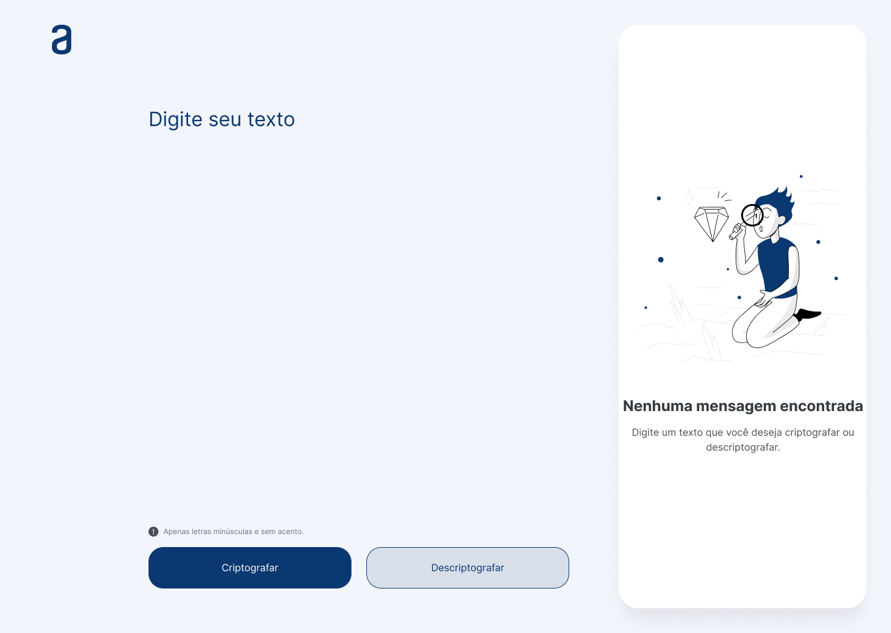

<h1 align="center">Codificador Alura </h1>

O projeto consiste na criação de uma página Web, utilizando HTML, CSS e JavaScript, buscando praticar os conceitos ensinados durante a trila básica de programação da <a href="https://www.alura.com.br/"> Alura</a>

## Súmario

- [📦 Temas abordados](#topics)
- [🏆 Desafio](#challenges)

<h2 id="features">✨ Features </h2>

- HTML
- Formulário
- CSS
- Responsividade
- JavaScript

<h2 id="challenges">🏆 Desafio</h2>

Como parte final do desafio, nos foi passado um protótipo de figma para colocarmos em prática todos os conceitos abordados até o momemto. Nossa aplicação consiste em um Input na qual irá pegar os valores (somente valores do tipo texto) e transcrever essas informações. Ao utilizarmos a opção para criptografar o texto o mesmo deverá ser convertido e nos possibilitar a opção de voltarmos esse texto ao normal.
